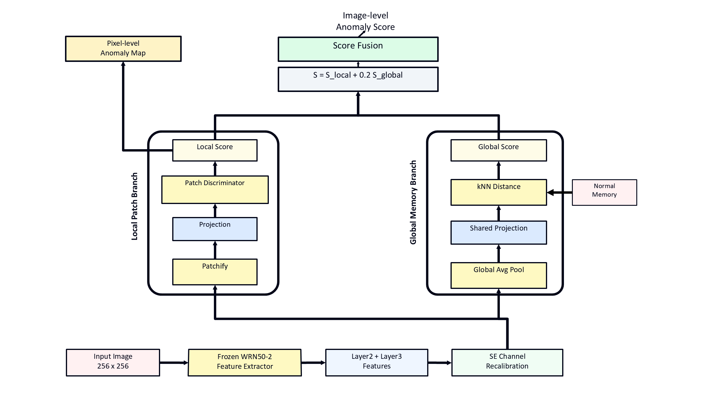

# CAGM-SimpleNet

Channel-Attentive Global Memory SimpleNet for LOCO anomaly detection.



## Overview

CAGM-SimpleNet is a lightweight anomaly detection model built on a SimpleNet-style local patch discriminator. The model keeps the local patch projection and patch discriminator as the main localization path, and adds two compact modules for stronger image-level anomaly scoring:

- **SE channel recalibration**: refines layer features before patch scoring.
- **Calibrated global kNN memory**: compares image-level features with normal training memories and adds a calibrated global anomaly score.

The default score fusion is:

```text
S = S_local + 0.2 * S_global
```

The global memory branch mainly improves image-level logical anomaly detection. Pixel-level anomaly maps are still generated by the local patch branch.

## Tested Environment

The current project was tested in the `yolo11` conda environment on Windows.

| Package | Version |
| --- | --- |
| Python | 3.10.20 |
| PyTorch / torch | 2.5.0 |
| torchvision | 0.20.0 |
| pandas | 2.3.3 |
| numpy | 2.0.1 |
| opencv-python | 4.13.0.92 |
| timm | 1.0.27 |
| scikit-learn | 1.7.2 |
| scipy | 1.15.3 |
| pillow | 11.1.0 |

The default runner uses:

```text
D:\anaconda\envs\yolo11\python.exe
```

If your Python path is different, pass it with `-PythonExe`.

## Dataset

This repository does not include the LOCO dataset.

Download MVTec LOCO AD from the official MVTec page:

```text
https://www.mvtec.com/company/research/datasets/mvtec-loco
```

After downloading and extracting the dataset, keep the original folder structure. The default local path used by the run script is:

```text
D:\datasets\loco_ad
```

Expected category folders:

```text
D:\datasets\loco_ad\
  breakfast_box\
  juice_bottle\
  pushpins\
  screw_bag\
  splicing_connectors\
```

If your dataset is stored elsewhere, pass a different path with `-DataPath`.

## Repository Structure

```text
CAGM-SimpleNet-main/
  main.py                   # training and evaluation entry point
  simplenet.py              # CAGM-SimpleNet model implementation
  backbones.py              # backbone loader
  common.py                 # shared feature and segmentation utilities
  metrics.py                # metric computation
  resnet.py                 # ResNet backbone definition
  utils.py                  # logging and helper utilities
  datasets/                 # dataset loaders
  imgs/cover.png            # architecture figure used in this README
  run_loco_ad.ps1           # main Windows PowerShell runner
  run_loco_ad_live.cmd      # convenient Windows command wrapper
  run_loco_ad_yolo11.ps1    # yolo11 helper runner
```

## Run the Model

Open PowerShell or CMD in the repository root:

```powershell
cd D:\simple_net8\CAGM-SimpleNet-main
```

Run the default CAGM-SimpleNet setting:

```powershell
.\run_loco_ad_live.cmd -DataPath "D:\datasets\loco_ad" -RunName cagmsimplenet_m5
```

Dry run the command without starting training:

```powershell
.\run_loco_ad_live.cmd -DryRun
```

Run with the default configuration written explicitly:

```powershell
.\run_loco_ad_live.cmd `
  -DataPath "D:\datasets\loco_ad" `
  -RunName cagmsimplenet_m5 `
  -MetaEpochs 5 `
  -GanEpochs 4 `
  -BatchSize 8 `
  -NumWorkers 0 `
  -FeatureAttention se `
  -AttentionReduction 16 `
  -GlobalNNBranch true `
  -GlobalNNWeight 0.2 `
  -GlobalNNK 5
```

If your Python executable is not in the default `yolo11` path:

```powershell
.\run_loco_ad_live.cmd `
  -PythonExe "D:\anaconda\envs\yolo11\python.exe" `
  -DataPath "D:\datasets\loco_ad" `
  -RunName cagmsimplenet_m5
```

## Default Training Configuration

| Setting | Value |
| --- | --- |
| Backbone | WideResNet50-2 |
| Extracted layers | layer2, layer3 |
| Feature attention | SE |
| Attention reduction | 16 |
| Pre-projection | enabled |
| Projection dimension | 1536 |
| Patch size | 3 |
| Meta epochs | 5 |
| Discriminator epochs | 4 |
| Batch size | 8 |
| Num workers | 0 |
| Global memory branch | enabled |
| Global memory k | 5 |
| Global memory score weight | 0.2 |
| Resize | 329 |
| Image size | 288 |

## Output

Training and evaluation outputs are written under:

```text
results/
```

Use a new `-RunName` for each experiment to avoid mixing old and new results:

```powershell
.\run_loco_ad_live.cmd -RunName cagmsimplenet_m5_fresh
```

## Reported Result

Current LOCO image-level AUROC used in the paper draft:

| Method | LOCO I-AUROC |
| --- | ---: |
| SimpleNet baseline | 77.6 |
| CAGM-SimpleNet | 81.6 |

This number is for image-level anomaly detection. Pixel-level localization should be evaluated separately because the global memory branch changes the image score, not the local anomaly map generation.

## Files Not Uploaded to GitHub

Datasets, checkpoints, experiment outputs, and result tables are intentionally ignored:

```text
results/
runs/
checkpoints/
*.pth
*.pt
*.ckpt
*.onnx
*.csv
*.tsv
__pycache__/
.idea/
.vscode/
```

Keep large trained weights and datasets outside Git. If they need to be shared, use a release asset, cloud storage, or Git LFS.

## License

See [LICENSE](LICENSE).
